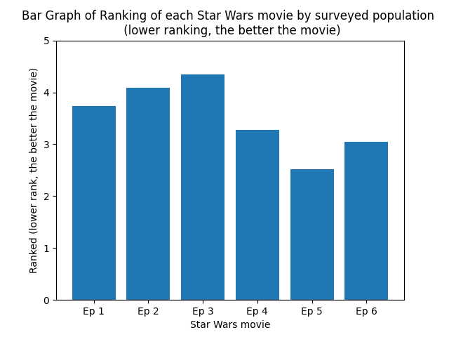
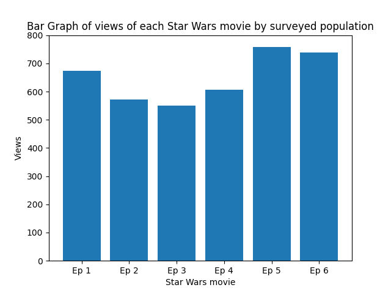

# 8.-Star-Wars-Data-Analysis-Python :moon::rocket:
A personal project to analyse data from a Star Wars survey. Python Libraries used: Pandas, Matplotlib

## Thoughts on starting this project
My seventh programming project, in Python. 

After learning about some Python Libraries commonly used in data analysis, Numpy, Pandas and Matplotlib, I figured I should put what I have learnt to the test, by
making a personal project on data analysis, and familiar myself on the process of analysing data (apart from the collecting data part since I get the dataset online)
such as Cleaning and Preparing data, Modelling and Analysing data, and sharing any discovery about said dataset.

<br>

Computer program used for coding: VS Code

## Repository directory description:
Let's start with:
1. Sources and Context
2. Cleaning and Preparing Data
3. Data Modelling and Analysis
4. Analysing Other Aspects of the Dataset

<br>

<br>

**1. Sources and Context**

The Dataquest website provides some guidance and provides the tasks in order to analyse some of the data in the dataset. The 'Starwars_data_analysis_project' folder
is organised to tasks from the website. '1.Task1.py' to '4.Task4.py' is on Cleaning and Preparing the data while '5.Task5.py' to '6.Task6.py' is on Data Modelling and
Analysis. '7.Task7.py' and '7.Task7.5.py' is to analyse another aspect of data from the dataset.

I have transferred the tasks from the website as instructions into my respective code files.

Learnt more regarding how to clean data from the cleaning data guide (in source(s))

Source(s): https://app.dataquest.io/c/25/m/201/guided-project%3A-star-wars-survey/1/how-guided-projects-work (Dataquest (main project guide)), 
https://www.w3schools.com/python/pandas/pandas_cleaning.asp (W3Schools (cleaning data guide))

Dataset analysed [here](https://github.com/fivethirtyeight/data/blob/master/star-wars-survey/StarWars.csv) (Star Wars Survey)

<br>

<br>

**2.Cleaning and Preparing Data**

_Task 1_
```python
import pandas as pd

#From the website instructions: We need to specify an encoding, because the dataset has some characters 
#that aren't in Python's default utf-8 encoding. You can read more about character encodings on developer 
#Joel Spolsky's blog. (this is still quite new to me. Ill leave this comment here to explain the 'encoding' function)
starwars = pd.read_csv('StarWars.csv', encoding="ISO-8859-1")
print(starwars.head(10))

print(starwars.columns)
```
Not much for Task 1, just to load the dataset into the file and printing out top 10 rows and the column titles. (more explanation of the code in comments in the code)

<br>

_Task 2_
```python
import pandas as pd

starwars = pd.read_csv('StarWars.csv', encoding="ISO-8859-1")

a = starwars['Have you seen any of the 6 films in the Star Wars franchise?']
b = starwars['Do you consider yourself to be a fan of the Star Wars film franchise?']

starwars.loc[a == 'Yes', 'Have you seen any of the 6 films in the Star Wars franchise?'] = True
starwars.loc[a == 'No', 'Have you seen any of the 6 films in the Star Wars franchise?'] = False
starwars.loc[b == 'Yes', 'Do you consider yourself to be a fan of the Star Wars film franchise?'] = True
starwars.loc[b == 'No', 'Do you consider yourself to be a fan of the Star Wars film franchise?'] = False

#The 'fillna()' function (for datacleaning) replaces the NULL values with a specified value.
#The 'fillna()' function returns a new DataFrame object unless the inplace parameter is set to True, 
#in that case the fillna() method does the replacing in the original DataFrame instead.
a.fillna('NaN', inplace=True)
b.fillna('NaN', inplace=True)
```
For Task 2, the task is to clean and prepare the 2 columns stored in variables 'a' and 'b'. To do that, I changed any values of 'Yes' as True, 'No' as False, and using
'.fillna()' function to fill any missing values or NULL as 'NaN'.

```python
#'value_counts()' function allows us to see all of the unique values in a column, 
#along with the total number of times each value appears.
#Started from row of index 1 to not get 'Response' as an unique value of the column
print(a.value_counts())
print(b.value_counts())

#Saved any changes to this temporary dataset cuz VS Code terminal dosen't let me see everything at once 
#whenever I want to print stuff for checking

starwars.to_csv('StarWars2.csv')
```
Then, using '.value_counts()' functions to get number of each unique input (True, False and NaN) in the columns 'a' and 'b' respectively.

Loaded edited dataset into a new file so I can load it into another code file. And so I can view the dataset as a whole as VS Code dosen't allow me to see the full thing in its terminal.

<br>

_Task 3_
```python
#Using '.replace()' function may work as well
#Along with using 'rename()' function to rename column names in a dataframe
#starwars = starwars.rename(columns = {'Which of the following Star Wars films have you seen? Please select all that apply.': 'seen_ep1', 'Unnamed: 4': 'seen_ep2', 'Unnamed: 5': 'seen_ep3', 'Unnamed: 6': 'seen_ep4', 'Unnamed: 7': 'seen_ep5', 'Unnamed: 8': 'seen_ep6'})

#'.isnull()' function detects missing values for an array-like object and returns True for null, and False if not
#null. Added '~' to reverse the Boolean markings
starwars2 = ~starwars.iloc[:,4:10].isnull().copy()
print(starwars2['Which of the following Star Wars films have you seen? Please select all that apply.'])

#Drop columns of index 4 to 9 
starwars = starwars.drop(columns=['Which of the following Star Wars films have you seen? Please select all that apply.' ,'Unnamed: 4', 'Unnamed: 5', 'Unnamed: 6', 'Unnamed: 7', 'Unnamed: 8'])

#Inserting columns back (The only method that worked for me, tho definitely have better ways to do this)
starwars.insert(4, 'seen_ep1', starwars2['Which of the following Star Wars films have you seen? Please select all that apply.'])
starwars.insert(5, 'seen_ep2', starwars2['Unnamed: 4'])
starwars.insert(6, 'seen_ep3', starwars2['Unnamed: 5'])
starwars.insert(7, 'seen_ep4', starwars2['Unnamed: 6'])
starwars.insert(8, 'seen_ep5', starwars2['Unnamed: 7'])
starwars.insert(9, 'seen_ep6', starwars2['Unnamed: 8'])
```
For task 3, the task is to rename the column titles to something more understandable instead of e.g. 'Unnamed: 4'. And to change that if a user has seen a particular
star wars movie, make it True, else if they haven't watched it (which they will leave the values as void/NULL), as False.

The recommended way by Dataquest was to rename the columns, then individually use conditional changes to change the values to its respective boolean markings. 

In my code, I made a copy of the portion of the code (columns 9 to 14) and used 'isnull()' function to change the values to Boolean, and then dropping that portion in the main code, before re-inserting, using the '.insert()' function to assign a title (to rename the column) and at the same joining back the columns at its original position.

<br>

_Task 4_
```python
import pandas as pd

starwars = pd.read_csv('StarWars3.csv', encoding="ISO-8859-1")
starwars['Have you seen any of the 6 films in the Star Wars franchise?'].fillna('NaN', inplace=True)
starwars['Do you consider yourself to be a fan of the Star Wars film franchise?'].fillna('NaN', inplace=True)

#Getting rid of 'Unnamed: 0' and 'Unnamed: 0.1' columns
starwars = starwars.set_index('RespondentID')
starwars = starwars.drop(columns='Unnamed: 0')
starwars = starwars.drop(columns='Unnamed: 0.1')
print(starwars.columns[8:14])

#Converting the datatypes to float for columns of index 8 to 14
starwars[starwars.columns[8:14]] = starwars[starwars.columns[8:14]].astype(float)

starwars = starwars.rename(columns={'Please rank the Star Wars films in order of preference with 1 being your favorite film in the franchise and 6 being your least favorite film.':'rank1', 'Unnamed: 10':'rank2', 'Unnamed: 11':'rank3', 'Unnamed: 12':'rank4', 'Unnamed: 13':'rank5','Unnamed: 14':'rank6'})
```
For Task 4, the task was to change the data type of the values in column 8 to 13 to floats (as they might be strings) so we can use them as floats for data modelling later when we draw graphs using the Matplotlib library (using '.astype()' function), and to rename said columns' title to something more understandable (done using the '.rename()' function)

Also, I noticed my dataset has excess old indexing from the transferring of my dataset from 1 code file to another so I used the '.drop()' function and the '.set_index()' with 'RespondentID' as index so I can remove these excess indexing. (which will affect the indexing of the columns, so something to be mindful of)

<br>

<br>

**3. Data Modelling and Analysis**

Up till now, the cleaning and preparing of the data will enable us to do some data analysis via looking at the patterns of the graphs and answer some questions about the Star Wars survey. In my code, I will see which Star Wars movie was ranked the best? (In Task 5)

I also created a bar graph showing which Star Wars movie has the most views out of the surveyed population. (In Task 6)

I have read in the discussions page in the Dataquest website that using correlation between these 2 graphs, that we may be able to have better insights into data analysis using the '.corr()' function. The code is done by someone else in the discussions page in the Dataquest website which I thought was quite interesting and a way to analyse data that I would want to try in future personal projects.

_Task 5_
```python
import matplotlib.pyplot as plt
import pandas as pd
```
```python
labels = ['Ep 1', 'Ep 2', 'Ep 3', 'Ep 4', 'Ep 5', 'Ep 6']
values = [starwars['rank1'].mean(), starwars['rank2'].mean(), starwars['rank3'].mean(), starwars['rank4'].mean(), starwars['rank5'].mean(), starwars['rank6'].mean()]

plt.bar(labels, values)

plt.title('Bar Graph of Ranking of each Star Wars movie \n (lower ranking, the better the movie)')
plt.xlabel('Star Wars movie')
plt.ylabel('Ranked (lower rank, the better the movie)')

plt.yticks([0,1,2,3,4,5])

plt.savefig('bargraph_rank_each_movie.png', dpi=100)

plt.show()
```



For Task 5, now that we have moved on to modelling data using graphs, I imported the Matplotlib library. The task is to see which was the most highly ranked Star Wars movie. To do this, the dataset asks people to rank the movies in the columns from 1 to 6 (representing Episode 1 to 6), 1 being the best and 6 being the worst. I did this by finding the mean of each column and plotting a bar graph using the mean to find the overall ranking of each Star Wars movie of the surveyed population.

From the graph, we can see that 'Star Wars: Episode V The Empire Strikes Back' has the lowest mean score, which means it was ranked highly by the most people as the best Star Wars movie and 'Star Wars: Episode III Revenge of the Sith' beings the lowest ranked (with the highest mean score).

Learnt how to code for plotting a bar graph in Matplotlib as demonstrated in my previous repository. (7.-NumPy-Pandas-Matplotlib-Learning-and-Practice-Python)

<br>

_Task 6_
```python
labels = ['Ep 1', 'Ep 2', 'Ep 3', 'Ep 4', 'Ep 5', 'Ep 6']
#Using '.sum()' function works because the function treats boolean as values. (1 for True and 0 for False)
#If worried that strings values may affect the result of '.sum()', you can convert all the string values to 0 just in vase
values = [starwars['seen_ep1'].sum(), starwars['seen_ep2'].sum(), starwars['seen_ep3'].sum(), starwars['seen_ep4'].sum(), starwars['seen_ep5'].sum(), starwars['seen_ep6'].sum()]

plt.bar(labels, values)

plt.title('Bar Graph of views of each Star Wars movie')
plt.xlabel('Star Wars movie')
plt.ylabel('Views')

plt.yticks([0,100,200,300,400,500,600,700,800])

plt.savefig('bargraph_views_each_movie.png', dpi=100)

plt.show()

```



For Task 6, the task is to see which Star Wars movie has the most views out of the surveyed population. To get the views of each Star Wars movie, since the '.sum()' function treats Boolean markings, True as 1 (and False and NULL as Zero (not relevant but FYI)), by getting the sum of the columns representing each movie, the total sum represents number of people who responded True and have watched each movie.

From the graph, we can see that 'Star Wars: Episode V The Empire Strikes Back' is the most viewed, while 'Star Wars: Episode III Revenge of the Sith' is the least viewed. This is may potentially be due to how well the surveyed population ranked the movie. (Ep 5 highest ranked as the best Star Wars movie, while Ep 3 lowest ranked as the worst Star Wars movie)

<br>

<br>

**4. Analysing Other Aspects of the Dataset**

Task 6 marked the end of the guided part of the data analysis of the Star Wars survey, and that Dataquest recommends that we try to analyse other aspects and find any interesting results from our analysis such as Does, Gender/If the person is a Star Wars fan/If the person is a Star Trek fan, affect the ranking and viewing of each Star Wars movie?

In Task 7 and 7.5, I decided to see whether fans of Star Trek (Task 7) may have a different ranking of the Star Wars movies compared to those that are not fans of Star Trek (Task 7.5).

_Task 7_
```python
a = starwars['Do you consider yourself to be a fan of the Star Trek franchise?']

starwars.loc[a == 'Yes', 'Do you consider yourself to be a fan of the Star Trek franchise?'] = True
starwars.loc[a == 'No', 'Do you consider yourself to be a fan of the Star Trek franchise?'] = False
a.fillna('NaN', inplace=True)

#We can split a DataFrame into two groups based on a binary column by creating two subsets of that column.
watched_st = starwars[a == True]
notwatched_st = starwars[a == False]
```
For Task 7, the task is to get ranking of fans of Star Trek of the Star Wars movies.

This code falls under cleaning and preparing the data section (see Task 2), where I converted 'Yes' responses to the column 'Do you consider yourself to be a fan of the Star Trek franchise?' as True, while 'No' responses to False, and 'NaN' for NULL values for easier manipulation of data during modelling and analysis.

Then I split the 2 groups of people (omitting those that left a NULL value) into 2 variables, 'watched_st' (watched Star Trek) and 'notwatched_st' (Not watched Star Trek)(for Task 7.5).

```python
labels = ['Ep 1', 'Ep 2', 'Ep 3', 'Ep 4', 'Ep 5', 'Ep 6']
values = [watched_st['rank1'].mean(), watched_st['rank2'].mean(), watched_st['rank3'].mean(), watched_st['rank4'].mean(), watched_st['rank5'].mean(), watched_st['rank6'].mean()]

plt.bar(labels, values)

plt.title('Bar Graph of Ranking of each Star Wars movie \n (lower ranking, the better the movie)')
plt.xlabel('Star Wars movie')
plt.ylabel('Points')

plt.yticks([0,1,2,3,4,5])

plt.savefig('bargraph(watchedstartrek)_views_each_movie.png', dpi=100)

plt.show()
```

_rank_each_movie.png)

Getting of the data for fans of Star Trek for the bar graph similar to data modelling and analysis (see Task 5) on taking the mean for the ranking score of each Star Wars movie column.

This graph shows the ranking by fans of Star Trek of the Star Wars movies.

<br>

_Task 7.5_
```python
a = starwars['Do you consider yourself to be a fan of the Star Trek franchise?']

starwars.loc[a == 'Yes', 'Do you consider yourself to be a fan of the Star Trek franchise?'] = True
starwars.loc[a == 'No', 'Do you consider yourself to be a fan of the Star Trek franchise?'] = False
a.fillna('NaN', inplace=True)

#We can split a DataFrame into two groups based on a binary column by creating two subsets of that column.
watched_st = starwars[a == True]
notwatched_st = starwars[a == False]
```
Exact same code as in Task 7, analysing of this code under Task 7.

```python
labels = ['Ep 1', 'Ep 2', 'Ep 3', 'Ep 4', 'Ep 5', 'Ep 6']
values = [notwatched_st['rank1'].mean(), notwatched_st['rank2'].mean(), notwatched_st['rank3'].mean(), notwatched_st['rank4'].mean(), notwatched_st['rank5'].mean(), notwatched_st['rank6'].mean()]

plt.bar(labels, values)

plt.title('Bar Graph of Ranking of each Star Wars movie \n (lower ranking, the better the movie)')
plt.xlabel('Star Wars movie')
plt.ylabel('Points')

plt.yticks([0,1,2,3,4,5])

plt.savefig('bargraph(notwatchedstartrek)_rank_each_movie.png', dpi=100)

plt.show()
```

_rank_each_movie.png)

Getting of the data for those who are not fans of Star Trek for the bar graph similar to data modelling and analysis (see Task 5) on taking the mean for the ranking score of each Star Wars movie column.

This graph shows the ranking by those who are not fans of Star Trek of the Star Wars movies.

<br>

_Analysis of Task 7 and Task 7.5 bar graphs_

General ranking of the Star Wars movies by fans and those who are not fans of Star Trek are the same. However, there is a pattern of the difference between the ranking of the top 3 Star Wars movies and the bottom 3 being more significant for those who are fans of Star Trek and those who are not fans of Star Trek (could this be that fans of Star Trek prefer watching the Star Wars movies 4, 5 and 6 more than those who aren't Star Trek fans due to similarities of movies 4, 5, 6 and Star Trek movies?)

<br>

<br>

## Thoughts after the project
This is my first time analysing data using a programming language. I ran into many bugs working with the Star Wars survey dataset such as manipulating of the columns and rows, data type of the values, and how to extract data that I need for analysis. By solving these bugs, I feel that I have learnt a lot and would be able to cleaning, extracting and analysing data much more smoothly with other datasets.

I initially started by previous repository (7.-NumPy-Pandas-Matplotlib-Learning-and-Practice-Python) and learning of NumPy, Pandas and Matplotlib with making a data analysis project as 1 of the goals, glad that I was able to somewhat complete (even though there can still be much improvements) it.

I spent most of my time on figuring out the right commands and fixing bugs at the cleaning and extracting stage and much less time on the drawing the graphs and analysing the data. I believe this is quite normal in the process of analysing data?

<br>

To be improved:
* Some of my codes are quite repetitive, loops/other commands can definitely shorten them.
* Can try to use correlation while analysing the data to find some interesting results.
* Can try working/analysing the data of other columns of the dataset such as 'Education', 'Location (Census Region)', and 'Which character shot first?' to find any interesting patterns to even more completely analyse this Star Wars survey dataset.
* Can try working/analysing the data from columns 15 to 29 (after cleaning the data) as well, which contain data on the characters respondents view favorably and unfavorably to find answers for questions such as 'Which character do respondents like the most?', 'Which character do respondents dislike the most?', .Which character is the most controversial (split between likes and dislikes)?'

<br>

Have a gif:


